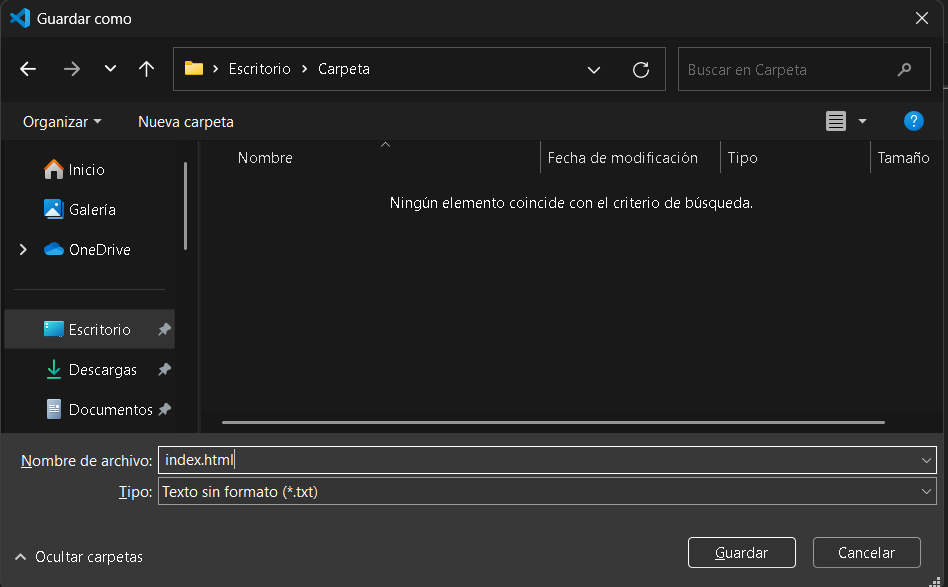
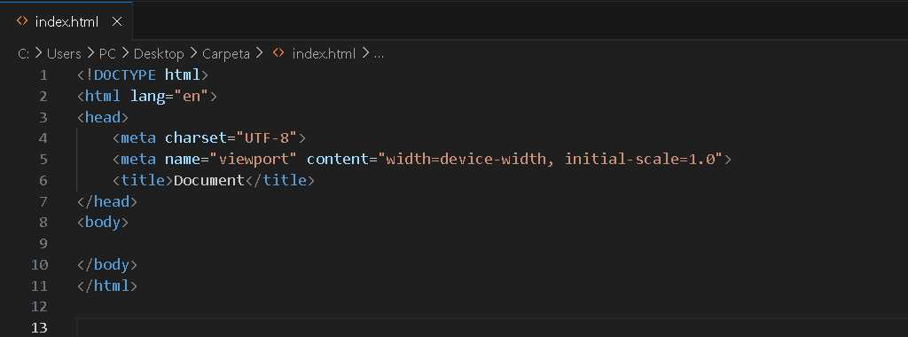
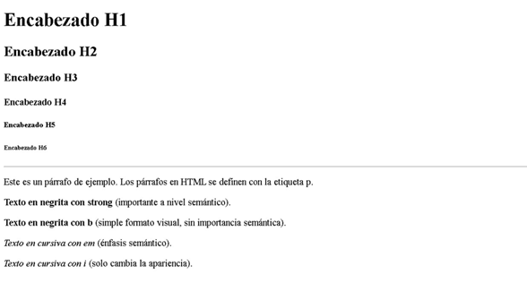
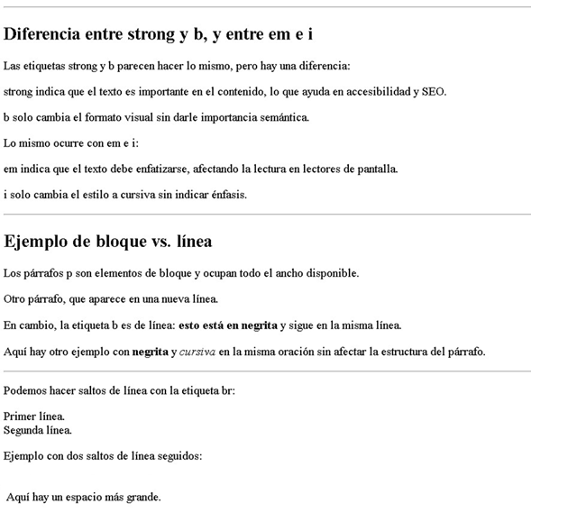

# Contenidos iniciales a HTML.
<div style="text-align: center">

</div>

<br>

## Introducción:
Antes de comenzar, quiero que piensen en cualquier página web que visitan todos los días: una red social, una tienda online o incluso un diario digital. ¿Alguna vez se preguntaron cómo están construidas? Detrás de cada página hay un lenguaje fundamental: `HTML`.

<hr>

`HTML` <i>(HyperText Markup Language)</i> es el esqueleto de cualquier sitio web. No es un lenguaje de programación, sino un lenguaje de marcado que nos permite estructurar el contenido de una página. Es como los cimientos de una casa: define dónde estarán los textos, imágenes, botones y enlaces.

Para entender cómo funciona, vamos a empezar con su estructura básica. Todo documento `HTML` tiene una organización específica que le indica al navegador cómo debe mostrar el contenido. Veamos la estructura mínima de una página web:

```HTML

<!DOCTYPE html>                               <!-- Define que el documento es HTML -->
<html lang="es">                              <!-- Etiqueta principal o raiz que encierra todo el contenido del documento-->
    <head>                                    <!-- Contiene información del documento, como el titulo, enlaces a CSS-->
        <meta charset="UTF-8">                <!-- Define la codificación de caracteres para soportar tildes y ñ-->
        <meta name="viewport" content="width-device-width, initial-scale=1.0">
                <!-- Ajusta la visualización en dispositivos móviles-->

        <title>Mi primera Documento HTML</title>   <!-- Define el título que aparece en la pestaña del navegador-->
    </head>
        <body>                                         <!-- Contiene todo el contenido visible del documento-->
        
        </body>
    </html>
```

## Visual Studio Code:

<div style="text-align: center">

</div>

<br>

Para escribir y organizar nuestro código, vamos a usar `Visual Studio Code (VS Code)`, un editor de texto avanzado que nos permite programar con facilidad.

`VS Code` nos ofrece herramientas como resaltado de sintaxis, autocompletado y extensiones que facilitan el desarrollo web.

Para comenzar, abriremos `VS Code` y crearemos una nueva carpeta para nuestro proyecto. Luego, dentro de esa carpeta, creamos un archivo llamado `ìndex.html`.

<br>



<br>

y escribimos la estructura básica que vimos antes.

<br>




## Video ilustrativo.

<video src="Videos/video1.mp4" controls="" style="witdh: 50vw"></video>

<hr>

<br>
<br>

## Ejercicios.

1. Realice el documento según la siguiente imagen:



Etiquetas utilizadas: `h1`, `h2`, `h3`, `h4`, `h5`, `h6`, `hr`, `p`, `strong`, `b`, `em` y `i`.

<br>
<br>

2. Realice el documento según la siguiente imagen:



Etiquetas utilizadas: `hr`, `p`, `b`, `i` y `br`.


